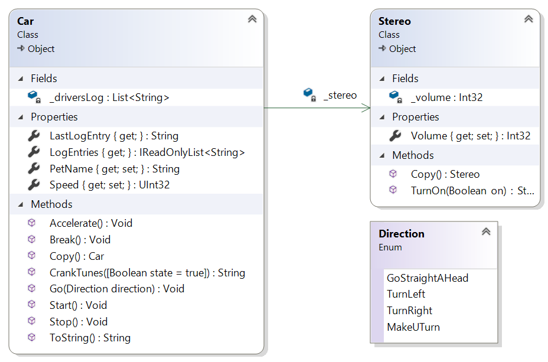

# ConsolingAssociation

<figure>

<figcaption>
Figur 1. Klassdiagram
</figcaption>
</figure>

Intressantast i klassdiagrammet är egenskapen `LogEntries`, fältet `_stereo` och metoden `Copy`.

## Car.cs

```cs
using System;
using System.Collections.Generic;
using System.Diagnostics;
using System.Linq;

namespace ConsolingAssociation
{
    public class Car
    {
        private List<string> _driversLog = new List<string>();
        private Stereo _stereo = new Stereo();

        public string LastLogEntry => _driversLog.LastOrDefault();

        public IReadOnlyList<string> LogEntries => _driversLog.AsReadOnly();

        public string PetName { get; set; }

        public uint Speed { get; private set; }

        public void Go(Direction direction)
        {
            switch (direction)
            {
                case Direction.GoStraightAHead:
                    _driversLog.Add($"{PetName} goes straight a head.");
                    break;

                case Direction.TurnLeft:
                    _driversLog.Add($"{PetName} turns left.");
                    break;

                case Direction.TurnRight:
                    _driversLog.Add($"{PetName} turns right.");
                    break;

                case Direction.MakeUturn:
                    _driversLog.Add($"{PetName} makes a U-turn.");
                    break;

                default:
                    throw new ArgumentException("Unsupported direction", nameof(direction));
            }
        }

        public void Accelerate() => _driversLog.Add($"{PetName} accelerates to {Speed += 5} km/h.");

        public void Break() => _driversLog.Add(Speed >= 5
            ? $"{PetName} slows down to {Speed -= 5} km/h."
            : $"{PetName} can't slow down more.");

        public Car Copy()
        {
            var other = (Car) MemberwiseClone();
            other._driversLog = new List<string>(_driversLog);
            other._stereo = _stereo.Copy();

            return other;
        }

        public string CrankTunes(bool state = true) => _stereo.TurnOn(state);

        public void Start()
        {
            Debug.Assert(Speed == 0, "The car can't be going before started.");
            _driversLog.Add($"{PetName} starts.");
        }

        public void Stop()
        {
            Speed = 0;
            CrankTunes(false);
            _driversLog.Add($"{PetName} stops.");
        }

        public override string ToString() => $"{PetName} is going at a rate of {Speed} km/h.";
    }
}
```

Egenskapen `LogEntries` ger tillgång till det privata fältet `_driversLog` utan att en så kallad "_privacy leak_" inträffar, vilket säkerställs genom att metoden `AsReadOnly` används. (Ett annat alternativ hade varit att skapa en kopia av `List`-objektet och returnera en referens till kopian.)

Fältet `_stereo` visas som en association mellan klassen `Car` och klassen `Stereo`, d.v.s. pilen mellan klasserna talar om att klassen `Car` ska ha ett privat fält i form av en referensvariabeln `_stereo` av typen `Stereo`. 

Metoden `Copy` skapar en "_deep copy_" av aktuellt `Car`-objekt. Det skapas kopior av associerade objekt då flera bilar inte kan dela på samma körjournal och bilstereo.